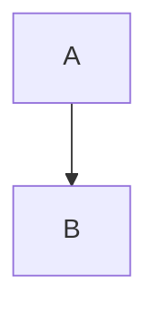

# Zenn Markdown 記法

Zenn 独自の拡張記法のみ記載。標準 Markdown は省略。

## Front Matter

Zenn 記事の先頭に必須。

```yaml
---
title: "タイトル"        # 必須。70文字以内
emoji: "📝"             # 必須。絵文字1文字
type: "tech"            # 必須。"tech" or "idea"
topics: ["opensearch"]  # 必須。1〜5個の配列
published: true         # 必須。true or false
publication_name: "xxx" # パブリケーション投稿時は必須
published_at: 2024-01-01 # 予約投稿・公開日指定時に使用 (YYYY-MM-DD)
---
```

### バリデーションルール

- `title`: 70文字以内
- `emoji`: 絵文字1文字のみ
- `type`: `tech` または `idea`
- `topics`: 配列、1〜5個
- `published`: `true` または `false`
- `publication_name`: パブリケーション投稿時は必須
- `published_at`: YYYY-MM-DD 形式

## メッセージボックス

```markdown
:::message
通常のメッセージ
:::

:::message alert
警告メッセージ
:::
```

## アコーディオン

```markdown
:::details タイトル
折りたたまれる内容
:::
```

ネスト時は外側の `:` を増やす:

```markdown
::::details 外側
:::message
内側
:::
::::
```

## コードブロック拡張

ファイル名表示（言語の後に `:ファイル名`）:

````markdown
```js:fooBar.js
const x = 1;
```
````

diff + シンタックスハイライト:

````markdown
```diff js
+    const foo = bar.baz([1, 2, 3]) + 1;
-    let foo = bar.baz([1, 2, 3]);
```
````

## 画像拡張

横幅指定（px）:

```markdown

```

キャプション（画像直下に `*` で囲む）:

```markdown

*キャプション*
```

## 埋め込み

URL のみの行（前後に空行）で自動カード化:

```markdown
https://zenn.dev/zenn/articles/markdown-guide
```

明示的カード:

```markdown
@[card](URL)
```

YouTube・X（Twitter）・GitHub ファイルも URL のみで埋め込み可。

SpeakerDeck:

```markdown
@[speakerdeck](スライドID)
```

## mermaid

````markdown

````

制限: 2000 文字以内、Chain 数 10 以下

## 注意事項

- 見出しは `##`（h2）から開始
- `_` を含む URL は `@[card](URL)` 形式で
- 画像パスは `/images/{slug}/` 形式（先頭 `/` 必須）
